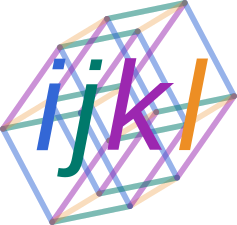

# Einshape: DSL-based reshaping library for JAX and other frameworks.

The `jnp.einsum` op provides a DSL-based unified interface to matmul and
tensordot ops.
This `einshape` library is designed to offer a similar DSL-based approach
to unifying reshape, squeeze, expand_dims, and transpose operations.

Some examples:

* `einshape("n->n111", x)` is equivalent to `expand_dims(x, axis=1)` three times
* `einshape("a1b11->ab", x)` is equivalent to `squeeze(x, axis=[1,3,4])`
* `einshape("nhwc->nchw", x)` is equivalent to `transpose(x, perm=[0,3,1,2])`
* `einshape("mnhwc->(mn)hwc", x)` is equivalent to a reshape combining
  the two leading dimensions
* `einshape("(mn)hwc->mnhwc", x, n=batch_size)` is equivalent to a reshape
  splitting the leading dimension into two, using kwargs (m or n or both) to
  supply the necessary additional shape information
* `einshape("mn...->(mn)...", x)` combines the two leading dimensions without
  knowing the rank of `x`
* `einshape("n...->n(...)", x)` performs a 'batch flatten'
* `einshape("ij->ijk", x, k=3)` inserts a trailing dimension and tiles along it
* `einshape("ij->i(nj)", x, n=3)` tiles along the second dimension

See `jax_ops.py` for the JAX implementation of the `einshape` function.
Alternatively, the parser and engine are exposed in `engine.py` allowing
analogous implementations in TensorFlow or other frameworks.

## Installation

Einshape can be installed with the following command:

```bash
pip3 install git+https://github.com/deepmind/einshape
```

Einshape will work with either Jax or TensorFlow. To allow for that it does not
list either as a requirement, so it is necessary to ensure that Jax or
TensorFlow is installed separately.

## Usage

Jax version:

```py
from einshape import jax_einshape as einshape
from jax import numpy as jnp

a = jnp.array([[1, 2], [3, 4]])
b = einshape("ij->(ij)", a)
# b is [1, 2, 3, 4]
```

TensorFlow version:

```py
from einshape import tf_einshape as einshape
import tensorflow as tf

a = tf.constant([[1, 2], [3, 4]])
b = einshape("ij->(ij)", a)
# b is [1, 2, 3, 4]
```

Numpy version:

```py
from einshape import numpy_einshape as einshape
import numpy as np

a = np.array([[1, 2], [3, 4]])
b = einshape("ij->(ij)", a)
# b is [1, 2, 3, 4]
```

## Understanding einshape equations

An einshape equation is always of the form `{lhs}->{rhs}`, where `{lhs}` and
`{rhs}` both stand for expressions. An expression represents the axes of an
array; the relationship between two expressions illustrate how an array should
be transformed.

An expression is a non-empty sequence of the following elements:

#### Index name

A single letter a-z, representing one axis of an array.

For example, the expressions `ab` and `jq` both represent an array of rank 2.

Every index name that is present on the left-hand side of an equation must
also be present on the right-hand side. So, `ab->a` is not a valid
equation, but `a->ba` is valid (and will tile a vector `b` times).

#### Ellipsis

`...`, representing any axes of an array that are not otherwise represented in
the expression. This is similar to the use of `-1` as an axis in a reshape
operation.

For example, `a...b` can represent any array of rank 2 or more: `a`
will refer to the first axis and `b` to the last. The equation `...ab->...ba`
will swap the last two axes of an array.

An expression may not include more than
one ellipsis (because that would be ambiguous). Like an index name, an ellipsis
must be present in both halves of an equation or neither.

#### Group

`({components})`, where `components` is a sequence of index names and ellipsis
elements. The entire group corresponds to a single axis of the array; the
group's components represent factors of the axis size. This can be used to
reshape an axis into many axes. All the factors except at most one must be
specified using keyword arguments.

For example, `einshape('(ab)->ab', x, a=10)` reshapes an array of rank 1 (whose
length must be a multiple of 10) into an array of rank 2 (whose first dimension
is of length 10).

Groups may not be nested.

#### Unit

The digit `1`, representing a single axis of length 1. This is
useful for expanding and squeezing unit dimensions.

For example, the equation `1...->...` squeezes a leading axis (which must have
length one).

## Disclaimer

This is not an official Google product.



